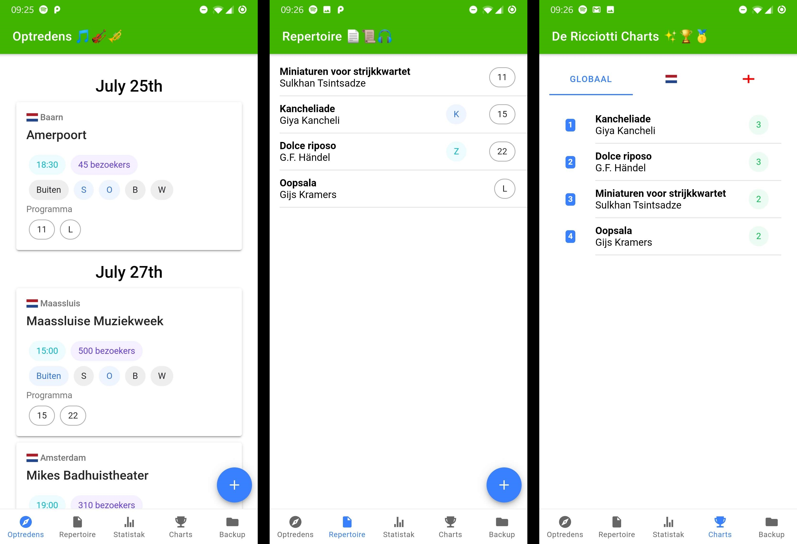
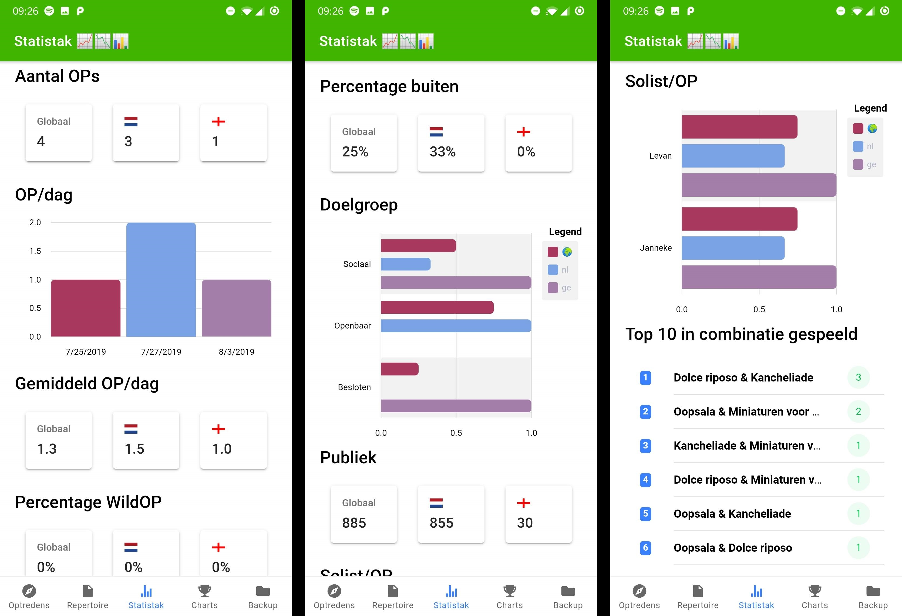

# Statistak

App for keeping track of tour performances, made for use on tour with the [Ricciotti Ensemble](https://ricciotti.nl)!




## Installation

Run `yarn` to install dependencies. Make sure to have the Android SDK installed and on path. The app needs either an emulator or a real device to be run on (due to SQLite dependency).

Run with:
```
ionic cordova run android -l
```

Debug remotely from your desktop in Chrome by entering `chrome://inspect` in the address bar.
